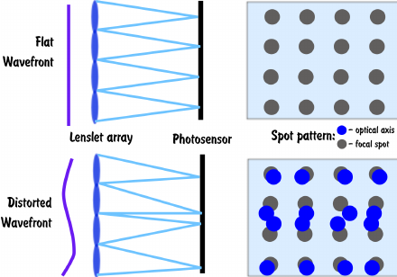

# Off-line AO-RL repositories

### 1) Usage

1) Data to learn off-line RL should be in data folder.
2) Jupyter notebook has some exploratory analysis.
3) Train with train_offline.py. Change list rep_paths = ["/gpfs/scratch/bsc28/bsc28921/outputs/replay_9_2m_10x10_replay"] with data path.

#### 2) Package requirements

For exploratory data analysis:

+ numpy
+ matplotlib
+ jupyter notebook

For training with train_offline.py
+ torch (tested with 1.2.0 in PowerPC architecture)
+ numpy (tested with 1.16.6 in PowerPC architecture)
+ tensorboardX
+ python (tested with version 3.7.6)

#### 3) Brief explanation of the problem.

Closed-loop Adaptive Optics:
a) Light wavefront from a distant star arrives as a planar wave into the atmosphere.
b) The atmosphere changes the shape of the wavefront due to refraction and the fact that the atmosphere is not homogeneous.
c) A closed-loop AO systems corrects this perturbation. It is formed by a deformable mirror that corrects the wavefront shape, a wavefront sensor that interprets the residual perturbation in the wavefront, a real time controller that issues the actions the DM has to take and a camera that constructs the image of the target.

#### The wavefront sensor

The wavefront sensor is formed by a lenslet array. Each lens focus the light on a subaperture. If the light is focused on the center of the subaperture the wavefront is planar. Otherwise some correction has to be made.

In a closed-loop, the wavefront sensor looks at the wavefront after the correction by the DM, hence it is looking at the residual error left to correct.

Image Source: https://www.researchgate.net/figure/Principle-of-the-Shack-Hartmann-wavefront-sensor-top-undistorted-wavefront-and_fig1_258516995

Usually, to understand the pixel information of each subaperture, the center of gravity (CoG) method is used. After producing the CoG for each subaperture a measurement vector, m, is produced that has the x and y coordinates of each subaperture.

m = (x_1, x_2, ... y_1, y_2 ...)

#### The real time controller

A typical controller calculates the command at each iteration with c = R · m. Where R is the command matrix, which is the pseudoinverse of the interaction matrix, D, calculated with the least squares approach minimising |m - D · c| < ε.

Due to error source such as delay, aliasing or noise the prediction from the command matrx is not perfect. Hence, the command is computed as an integrator with gain:

C_t = C_t-1 + g R m_t 

Where t indicates timestep.

#### The RL controller

To learn a RL controller we are using a policy, π, learned by Soft Actor Critic method to compute residual actions in the command at each timestep:

C_t = C_t-1 + g R m_t + a

a ~ π(s)

Where s is a state formed by past commands and current wavefront sensor measurements. The past commands are necessary as due to delay past commands will be executed in the future.

The action, a, is the delta term in the command law.

The reward method is the average measurements squared from the wavefront sensor.

#### RL References:
+ Soft Actor Critic: Haarnoja, Tuomas, et al. "Soft actor-critic algorithms and applications." arXiv preprint arXiv:1812.05905 (2018).
+ Residual Policy Learning: Silver, Tom, et al. "Residual policy learning." arXiv preprint arXiv:1812.06298 (2018).

#### offline RL learning
To improve the SAC controller before using it in the real environment pretraining of the controller on existing data could be used. 
However, due to the interaction of the controller with the environment during training this is not easy and literature provides examples of successfull and unsuccessfull approaches.

To solve our problem we try to adjust the ensemble methodology from the following paper:
+ Agarwal, Rishabh, Schuurmans, Dale and Norouzi, Mohammad "An Optimistic Perspective on Offline Reinforcement Learning" arXiv preprint arXiv:1907.04543 (2020).

However as our output space is continous and not discrete we are not able to use DeepQ-Learning as proposed in the paper. 
Therefore we try to apply the idea of using ensembles to the soft actor critic methodology.

##### Development
During the project the following different algorithms were developed:
0) simple SAC without modifications
1) ensemble of SACs all using the same data, the critics in the ensemble are than combined either with average or weighted mean. The diversity in the ensemble comes from the different initialization of the different agents.
2) ensemble of SACs which show different data to each SAC at each epoch. However after each epoch the data is shuffled so that after some epochs all SACs will have seen all the data.
3) ensemble of SACs using completly seperated datasets for each critic. Therefore each of the agents within the ensemble is only trained on part of the data which should give the most diverse ensemble.

##### Data
Different data was used to train the offline RL algorithms. These data diffenterate itself, by the way it was created and on what telescope it was created on
+ 2m
    1) replay_2m_10x10_linear
    2) replay_2m_10x10_rl
    3) replay_11_2m_replay
    4) replay_11_2m_new_replay_2
    5) replay_11_2m_new_replay_3
    6) replay_11_2m_fabian_noise_mu_0_sigma_01
    7) replay_11_2m_fabian_noise_mu_0_sigma_03
    8) replay_11_2m_fabian_noise_mu_0_sigma_05

+ 4m
    1) 4m_20x20_replay
    
##### Performance
To evaluate the offline reinforcement learning algorithm was trained with the data provided. To evaluate the performance of the agent created, this agent was put into the simulator and its performance was recorded. An overview of the performance with different combinations of datasets can be seen bellow.

###### 2m models
| Model             | Data   | number of critics | Epoch  | Score  |
|-------------------|--------|-------------------|--------|--------|
| 0) simple SAC | 1) | 1 | 50 | 0.44425 |
| 0) simple SAC | 2) | 1 | 50 | 0.93372 |
| 0) simple SAC | 1) + 2) | 1 | 50 | 0.93439 |
| |
| 3) separated SACs | 1) - 5) | 5 | 3 | 0.593436 |
| 3) separated SACs | 1) - 5) | 5 | 15 | 0.922587 |
| 3) separated SACs | 1) - 5) | 5 | 27 | 0.931105 |
| |
| 3) separated SACs | 1) - 5) | 10 | 3 | 0.113553 |
| 3) separated SACs | 1) - 5) | 10 | 15 | 0.914321 |
| |
| 3) separated SACs | 1) | 5 | 10 | 0.677788 |
| 3) separated SACs | 1) | 5 | 30 | 0.656674 |
| 3) separated SACs | 1) | 5 | 50 | 0.4549 |
| |
| 3) separated SACs | 1) | 10 | 10 | 0.590541 |
| 3) separated SACs | 1) | 10 | 30 | 0.272173 |
| 3) separated SACs | 1) | 10 | 50 | 0.134398 |
| |

###### 4m models
| Model             | Data   | number of critics | Epoch  | Score  |
|-------------------|--------|-------------------|--------|--------|
| 3) separated SACs | 1) | 5 | 3 | 0.734591 |
| 3) separated SACs | 1) | 5 | 15 | 0.223822 |
| 3) separated SACs | 1) | 5 | 27 | 0.573245 |
| 3) separated SACs | 1) | 5 | 48 | 0.700478 |
| |
| 3) separated SACs | 1) | 10 | 3 | 0.647786 |
| 3) separated SACs | 1) | 10 | 15 | 0.607662 |
| 3) separated SACs | 1) | 10 | 27 | 0.705842 |
| 3) separated SACs | 1) | 10 | 48 | 0.634988 |
| |

